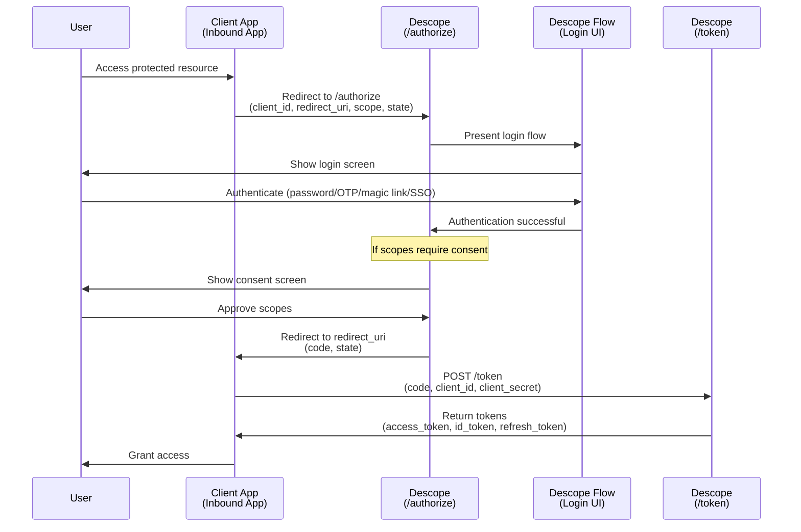
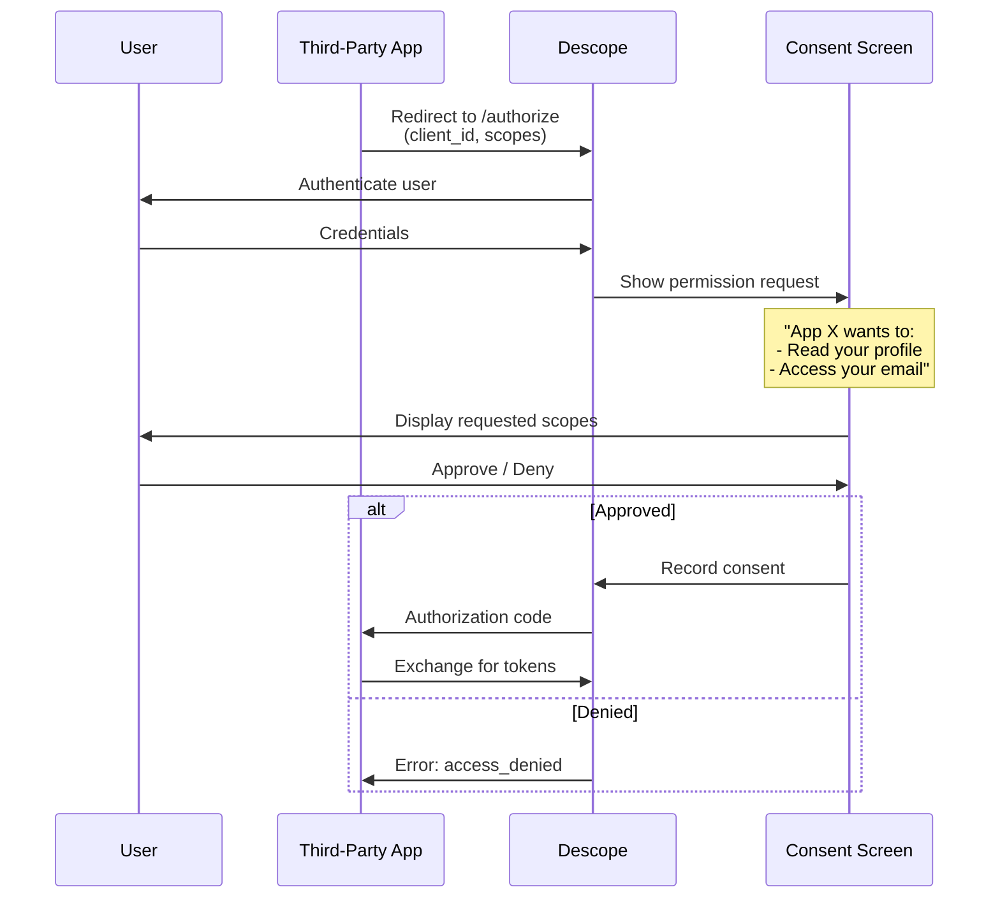
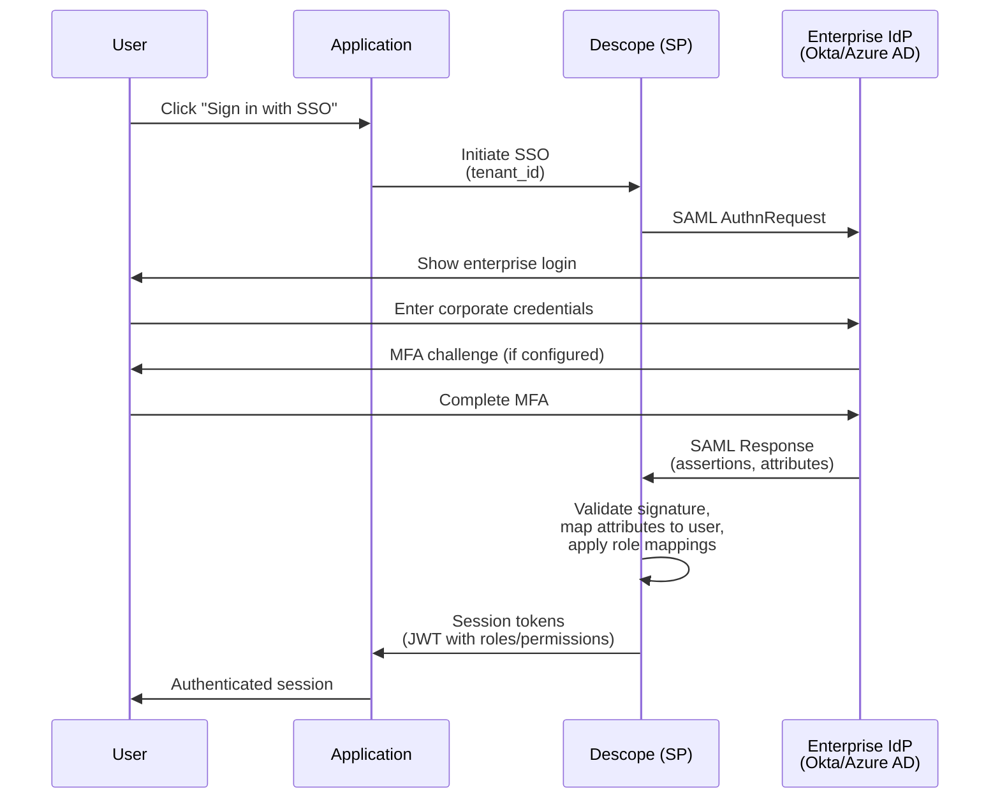
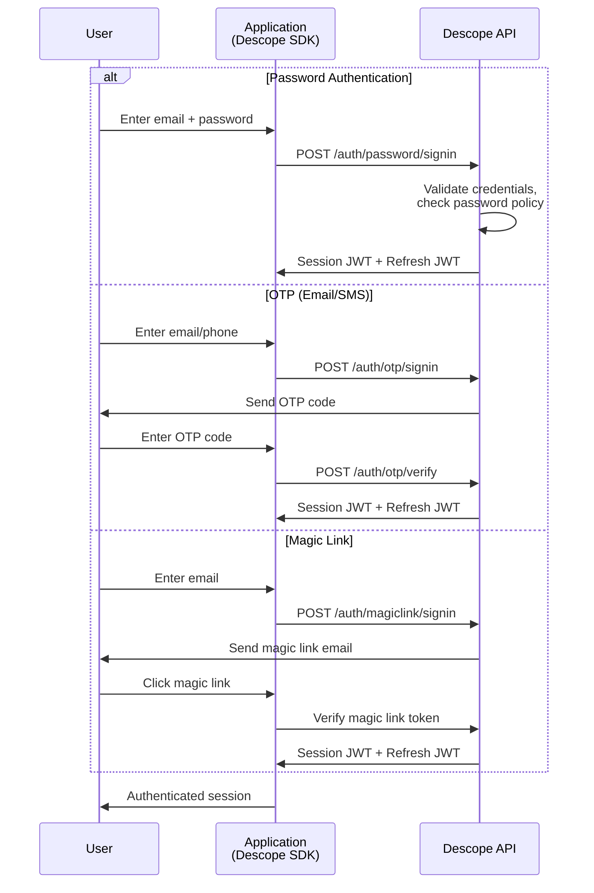
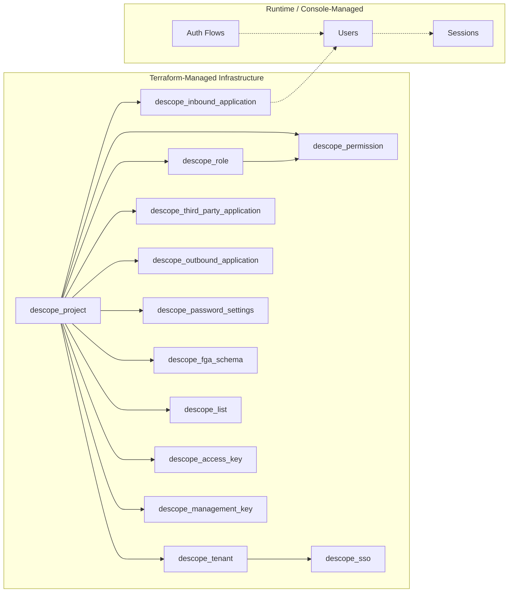

# Authentication and Authorization Flows

This document provides sequence diagrams for Descope's authentication and authorization flows.

## OAuth 2.0 Authorization Code Flow (Descope as IdP)

When an external application (Inbound App) uses Descope as its identity provider:



## Third-Party App Consent Flow

When a third-party application requests access to user data:



## SSO / SAML Federation Flow

When a tenant has SAML SSO configured:



## Standard Authentication Flow

Direct authentication without OAuth (SDK-based):



## Authorization Model

How the three authorization layers compose:

```mermaid
graph TB
    subgraph "Authorization Decision"
        Decision[Access Granted?]
    end

    subgraph "Layer 1: RBAC"
        User[User] --> ProjectRoles[Project Roles]
        User --> TenantRoles[Tenant Roles]
        ProjectRoles --> Permissions[Permissions]
        TenantRoles --> Permissions
    end

    subgraph "Layer 2: FGA / ReBAC"
        FGASchema[FGA Schema<br/>types + relations] --> Relations[Relations<br/>user:alice#owner@doc:1]
        Relations --> FGACheck{FGA Check<br/>Is alice viewer of doc:1?}
    end

    subgraph "Layer 3: Lists"
        IPList[IP Allowlist] --> IPCheck{IP in list?}
        TextList[Text Denylist] --> TextCheck{Domain blocked?}
    end

    Permissions --> Decision
    FGACheck --> Decision
    IPCheck --> Decision
    TextCheck --> Decision
```

## Terraform Resource Flow

Which Terraform resources configure each part of the auth infrastructure:



## Further Reading

- [Descope Authentication Methods](https://docs.descope.com/auth-methods)
- [Descope OIDC Endpoints](https://docs.descope.com/getting-started/oidc-endpoints)
- [Descope Inbound Apps](https://docs.descope.com/identity-federation/inbound-apps/using-inbound-apps)
- [Descope SSO Configuration](https://docs.descope.com/tenant-management/sso/how-authorization-works-with-sso-providers)
- [Descope RBAC](https://docs.descope.com/authorization/role-based-access-control)
- [Descope FGA/ReBAC](https://docs.descope.com/authorization/rebac)
