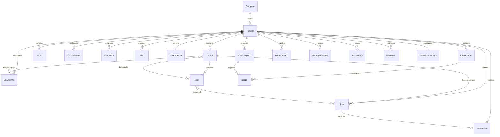

# Descope Entity Model

This document describes the Descope data model, how entities relate to each other, and which are managed by this Terraform provider.

## Entity Relationship Diagram



## Entity Categories

### Infrastructure (Terraform-Managed)

These entities represent project configuration and are the natural domain of infrastructure-as-code:

| Entity | Terraform Resource | Description |
|--------|-------------------|-------------|
| Project | `descope_project` | Top-level configuration unit. All other entities belong to a project. |
| Tenant | `descope_tenant` | B2B multi-tenancy. Isolates users, roles, and SSO config. |
| Role | `descope_role` | Authorization role. Can be project-level or tenant-level. |
| Permission | `descope_permission` | Atomic authorization unit. Assigned to roles. |
| Inbound Application | `descope_inbound_application` | OIDC/OAuth client registered to use Descope as IdP. |
| Third-Party Application | `descope_third_party_application` | External OAuth client authenticating against Descope. |
| Outbound Application | `descope_outbound_application` | OAuth client config for Descope to connect to external services. |
| SSO Configuration | `descope_sso` | OIDC or SAML SSO provider configuration per tenant. |
| Password Settings | `descope_password_settings` | Password policy (min length, complexity, lockout, expiration). |
| Management Key | `descope_management_key` | API key for management operations. |
| Access Key | `descope_access_key` | Service-to-service authentication token. |
| Descoper | `descope_descoper` | Admin user with management console access. |
| FGA Schema | `descope_fga_schema` | Fine-grained authorization schema (ReBAC relations). |
| List | `descope_list` | IP allowlist/denylist or text-based filter list. |

### Infrastructure (Data Sources)

| Entity | Terraform Data Source | Description |
|--------|----------------------|-------------|
| Project Export | `descope_project_export` | Full project configuration snapshot as JSON. |
| Password Settings | `descope_password_settings` | Read current password policy. |
| FGA Check | `descope_fga_check` | Query FGA authorization for a relation tuple. |

### Runtime (NOT Terraform-Managed)

These entities are created and managed at application runtime, not during infrastructure provisioning:

| Entity | Why Not Terraform | How to Manage |
|--------|------------------|---------------|
| Users | Runtime data created by user signups/logins. Managing users as TF resources would be like managing database rows in Terraform. | Descope SDKs, Management API, Console |
| Flows | Visual authentication flows (screens, widgets, logic). Designed for the Descope console's drag-and-drop editor. | Descope Console, `descopecli` |
| JWT Templates | Nested within project configuration. Already managed by the `descope_project` resource. | `descope_project` resource |
| Connectors | Nested within project configuration (HTTP, SMTP, Twilio, etc.). Already managed by the `descope_project` resource. | `descope_project` resource |
| Audit Events | Read-only operational log. Not infrastructure. | Management API, Console |

## Key Relationships

### Multi-Tenancy Model

```
Project
  +-- Tenant A
  |     +-- Users (subset)
  |     +-- Tenant-level Roles
  |     +-- SSO Config (SAML/OIDC)
  +-- Tenant B
  |     +-- Users (subset)
  |     +-- Tenant-level Roles
  |     +-- SSO Config
  +-- Project-level Roles (shared across tenants)
  +-- Project-level Permissions
```

A user can belong to multiple tenants with different roles in each. Project-level roles are inherited by all tenants.

### Application Model

- **Inbound Apps**: External applications that use Descope as an identity provider (IdP). Descope acts as the OAuth 2.0 Authorization Server.
- **Third-Party Apps**: Similar to inbound apps but registered as third-party OAuth clients with consent flows.
- **Outbound Apps**: Descope acts as an OAuth client to connect to external services (e.g., GitHub, Google) on behalf of users.

### Authorization Layers

1. **RBAC** (Roles + Permissions): Traditional role-based access. Roles contain permissions. Users are assigned roles at project or tenant level.
2. **FGA/ReBAC** (Fine-Grained Authorization): Relationship-based access control with a schema defining object types and relations. Checked at runtime via the FGA Check API.
3. **Lists**: IP and text allowlists/denylists for network-level and content-level filtering.
